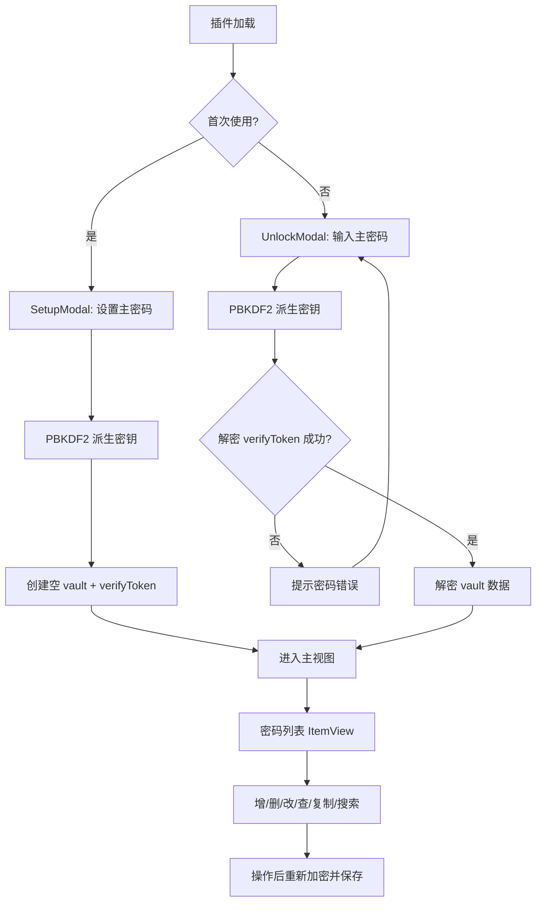

# OhMyPass — Obsidian 密码备忘录插件

## 1. 项目概述

OhMyPass 是一个 Obsidian 插件，为用户提供**本地化、加密的密码备忘录**功能。它将密码数据以 AES-GCM 加密形式存储在 Vault 本地，用户通过一个主密码（Master Password）解锁后，即可在 Obsidian 内完成密码条目的增删改查、搜索与复制。

### 核心定位

- **备忘录性质**：不追求替代专业密码管理器（1Password / Bitwarden），而是为已有 Obsidian 使用习惯的用户提供一个轻量、便捷的密码速查工具。
- **数据本地化**：所有数据存储在 Vault 内的 `data.json` 中，原生支持 Git / Obsidian Sync 同步，无需额外服务端。
- **安全底线**：AES-256-GCM 加密 + PBKDF2 密钥派生，确保即使 `data.json` 泄露也无法直接还原密码。

---

## 2. 功能需求

### 2.1 主密码机制

| 需求 | 描述 |
|:---|:---|
| 设置主密码 | 首次使用时提示设置主密码，用于派生加密密钥 |
| 解锁 | 插件加载后需输入主密码解锁，解锁后密钥驻留内存 |
| 自动锁定 | 一段时间无操作后自动清除内存中的密钥，需重新输入主密码 |
| 修改主密码 | Settings 中可修改主密码，修改后使用新密钥重新加密所有条目 |

### 2.2 密码条目管理（CRUD）

每条密码记录包含以下字段：

```typescript
interface PasswordEntry {
  id: string;           // UUID
  name: string;         // 服务名称，如 "GitHub"
  url?: string;         // 网址（可选）
  username: string;     // 用户名 / 邮箱
  password: string;     // 密码（加密存储）
  notes?: string;       // 备注（可选，加密存储）
  tags: string[];       // 多标签分类，如 ["社交", "工作/内部"] 支持嵌套路径
  createdAt: number;    // 创建时间戳
  updatedAt: number;    // 最后修改时间戳
}
```

| 操作 | 描述 |
|:---|:---|
| 添加 | 通过 Modal 表单添加新密码条目 |
| 查看 | 在插件主视图（ItemView）列表中查看所有条目 |
| 编辑 | 点击条目进入编辑 Modal，修改后保存 |
| 删除 | 支持删除单条记录，带确认提示 |
| 搜索/过滤 | 按名称、用户名、分类实时搜索过滤 |

### 2.3 便捷操作

| 功能 | 描述 |
|:---|:---|
| 复制密码 | 一键复制密码到剪贴板，30 秒后自动清除剪贴板 |
| 密码可见性切换 | 默认隐藏密码，点击切换显示/隐藏 |
| 随机密码生成 | 添加/编辑时可一键生成高强度随机密码（可配置长度与字符集） |
| 命令面板集成 | 注册 Command：打开密码库、添加新密码、锁定密码库 |

### 2.4 多标签分类系统

- 每条密码支持 **多个标签**（tags），如 `["社交", "工作"]`
- 标签支持 **嵌套路径**，使用 `/` 分隔层级，如 `"工作/内部系统"`、`"金融/银行"`
- 主视图侧边栏或下拉菜单中展示标签树，点击标签筛选对应条目
- 添加/编辑时支持从已有标签中选择或创建新标签
- 标签列表从所有条目中动态汇总，无需单独维护

### 2.5 导入/导出

| 功能 | 描述 |
|:---|:---|
| CSV 导入 | 从 CSV 文件批量导入密码条目，支持自定义列映射 |
| CSV 导出 | 将所有密码条目导出为明文 CSV（需解锁状态，操作前二次确认） |
| 加密备份导出 | 导出为加密的 JSON 备份文件（使用当前主密码加密） |
| 加密备份导入 | 从加密备份文件恢复，需输入备份时使用的主密码 |

### 2.6 设置项（SettingTab）

| 设置 | 默认值 | 描述 |
|:---|:---|:---|
| 自动锁定时间 | 5 分钟 | 无操作多久后自动锁定 |
| 剪贴板清除时间 | 30 秒 | 复制密码后多久清除剪贴板 |
| 默认密码长度 | 16 | 随机生成密码的默认长度 |
| 密码字符集 | 大小写+数字+特殊字符 | 随机密码包含的字符类型 |
| 修改主密码 | — | 修改主密码入口 |
| 导入/导出 | — | 导入导出操作入口 |

---

## 3. 技术方案

### 3.1 技术栈

| 层面 | 选型 |
|:---|:---|
| 语言 | TypeScript |
| 构建 | esbuild（Obsidian 官方模板内置） |
| 加密 | Web Crypto API（浏览器 / Electron 原生支持） |
| UI | Obsidian 原生 API（Modal, ItemView, Setting） |
| 数据存储 | `this.loadData()` / `this.saveData()`（Obsidian 插件标准方式，写入 `data.json`） |

### 3.2 项目结构

```
ohmypass/
├── manifest.json          # Obsidian 插件元数据
├── package.json           # 依赖管理
├── tsconfig.json          # TypeScript 配置
├── esbuild.config.mjs     # 构建配置
├── styles.css             # 插件样式
├── plan.md                # 本文档
└── src/
    ├── main.ts            # 插件入口：注册命令、视图、设置
    ├── types.ts           # 类型定义（PasswordEntry, PluginSettings 等）
    ├── crypto.ts          # 加密模块：PBKDF2 密钥派生 + AES-256-GCM 加解密
    ├── store.ts           # 数据存取层：加载/保存/增删改查密码条目
    ├── importExport.ts    # 导入导出：CSV 解析/生成、加密备份
    ├── views/
    │   └── PasswordListView.ts   # ItemView：密码列表主视图（含标签树筛选）
    ├── modals/
    │   ├── UnlockModal.ts        # 解锁输入主密码
    │   ├── SetupModal.ts         # 首次设置主密码
    │   ├── AddEditModal.ts       # 添加/编辑密码条目（含多标签选择器）
    │   ├── ConfirmDeleteModal.ts # 删除确认
    │   └── ImportExportModal.ts  # 导入导出操作界面
    ├── components/
    │   ├── PasswordGenerator.ts  # 随机密码生成器
    │   └── TagSelector.ts        # 多标签选择/创建组件
    └── settings/
        └── SettingTab.ts         # 插件设置面板
```

### 3.3 加密方案

```
用户主密码
    │
    ▼
┌─────────────────────────────────┐
│  PBKDF2 (SHA-256, 600000 轮)    │  ← salt（随机 16 字节，存于 data.json）
│  输出 256-bit AES Key           │
└─────────────────────────────────┘
    │
    ▼
┌─────────────────────────────────┐
│  AES-256-GCM 加密               │  ← iv（随机 12 字节，每次加密生成新 iv）
│  明文: JSON.stringify(entries)  │
│  输出: { iv, ciphertext }       │
└─────────────────────────────────┘
```

**关键安全措施：**

1. **密钥不落盘**：PBKDF2 派生出的 AES Key 仅保留在内存 (`CryptoKey` 对象)，不写入任何文件
2. **每次加密新 IV**：防止相同明文产生相同密文
3. **认证加密**：GCM 模式自带 Authentication Tag，篡改检测
4. **主密码验证**：在 `data.json` 中存储一个已知明文的加密版本作为验证令牌（verify token），解锁时尝试解密该令牌以验证主密码正确性

### 3.4 数据存储格式（data.json）

```jsonc
{
  // 加密元数据
  "salt": "base64...",           // PBKDF2 salt
  "verifyToken": {              // 主密码验证令牌
    "iv": "base64...",
    "ciphertext": "base64..."
  },
  // 加密后的密码条目
  "vault": {
    "iv": "base64...",
    "ciphertext": "base64..."   // JSON.stringify(PasswordEntry[]) 的加密结果
  },
  // 未加密的设置项
  "settings": {
    "autoLockMinutes": 5,
    "clipboardClearSeconds": 30,
    "defaultPasswordLength": 16,
    "passwordCharset": "all"
  }
}
```

### 3.5 核心交互流程



### 3.6 UI 方案

#### 主视图（PasswordListView — ItemView）

- 顶部：搜索栏 + 标签筛选下拉（支持嵌套展开）+ "添加"按钮 + "导入/导出"按钮
- 列表：卡片式展示每条密码记录
  - 显示：服务名称、用户名、标签徽章（多个）
  - 操作按钮：复制密码、编辑、删除
  - 密码默认以 `••••••••` 显示，支持点击切换可见
- 标签筛选：支持按标签树层级过滤，选中父标签自动包含子标签
- 底部状态栏：显示总条目数/筛选后条目数、锁定状态

#### Modal 风格

- 统一使用 Obsidian 原生 `Modal` 和 `Setting` 组件构建表单
- 保持与 Obsidian 主题一致的视觉风格（自动适配深色/浅色主题）

---

## 4. 安全声明

> [!WARNING]
> OhMyPass 是一个**密码备忘录**工具，不是专业密码管理器。
> - 它不提供浏览器自动填充功能
> - 它的安全性依赖于用户主密码的强度
> - 如有高安全需求，推荐使用 Bitwarden / 1Password 等专业工具
> - 主密码一旦遗忘，加密数据**不可恢复**

---

## 5. 开发里程碑

| 阶段 | 内容 | 预估 |
|:---|:---|:---|
| **P0 - 基础框架** | 项目脚手架、加密模块、数据存取层、主密码设置/解锁 | 1-2 天 |
| **P1 - 核心功能** | 密码列表视图（ItemView）、添加/编辑/删除 Modal、搜索过滤、多标签系统 | 2-3 天 |
| **P2 - 增强功能** | 密码生成器、剪贴板管理、自动锁定、命令面板集成、导入/导出 | 1-2 天 |
| **P3 - 打磨** | UI 样式优化、深/浅主题适配、错误处理、边界情况 | 1 天 |

---

## 6. 决策记录

| 问题 | 决策 |
|:---|:---|
| 导入/导出 | ✅ 需要。支持 CSV 导入导出 + 加密备份 |
| 多 Vault 加密隔离 | ❌ 不需要。所有条目使用同一密钥 |
| 分类系统 | ✅ 多标签 + 嵌套路径（`/` 分隔） |
| 密码强度检测 | ❌ 不需要 |
